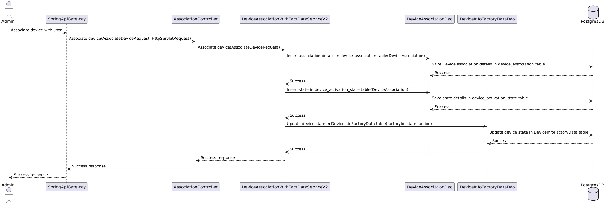

<div align="center">
  
</div>

[](https://github.com/eclipse-ecsp/device-association/actions/workflows/maven-build.yml)
[](https://sonarcloud.io/summary/new_code?id=eclipse-ecsp_device-association)
[](https://sonarcloud.io/summary/new_code?id=eclipse-ecsp_device-association)
[](https://github.com/eclipse-ecsp/device-association/actions/workflows/licence-compliance.yaml)
[](https://github.com/eclipse-ecsp/device-association/releases)

# Device Association
Device Association Component provides restful services for associating the device with a user, retrieving association details and terminating/suspending (when user doesn’t have any active subscription)/restoring devices. It also provides restful services for Many-to-Many Association and Terminations.

# Table of Contents
* [Getting Started](#getting-started)
* [Architecture](#architecture)
* [Usage](#usage)
* [How to contribute](#how-to-contribute)
* [Built with Dependencies](#built-with-dependencies)
* [Code of Conduct](#code-of-conduct)
* [Contributors](#contributors)
* [Security Contact Information](#security-contact-information)
* [Support](#support)
* [Troubleshooting](#troubleshooting)
* [License](#license)
* [Announcements](#announcements)


## Getting Started

To build the project in the local working directory after the project has been cloned/forked, run:

```mvn clean install```

from the command line interface.

### Prerequisites

The list of tools required to build and run the project:
    * Java 17
    * Maven 3.8 or higher

Download and Install Apache Maven 3.8 locally and follow the below steps:
* Go to the right corner of the IDE and get inside the Maven option.
* Select the Maven Settings option and set the Maven Home Path to the path of the Apache Maven 3.8 installed locally.
* Click Apply and then OK.

2. Postgres DB needs to be installed and database/schema should be created with the required tables.

* Link of the database and table scripts to be installed :
  [dmpostgres.sql](../../../ecsp-helm-charts/blob/main/postgresql/db-scripts/dmpostgres.sql)

### Installation

[Install Java](https://www.azul.com/downloads/?version=java-17-lts&package=jdk#zulu)

[How to set up Maven](https://maven.apache.org/install.html)

### Coding style check configuration

[checkstyle.xml](./association-api/checkstyle.xml) is the coding standard to follow while writing new/updating existing code.

Checkstyle plugin [maven-checkstyle-plugin:3.2.1](https://maven.apache.org/plugins/maven-checkstyle-plugin/) is integrated in [pom.xml](./pom.xml) which runs in the validate phase and check goal of the maven lifecycle and fails the build if there are any checkstyle errors in the project.

To run checkstyle plugin explicitly, run the following command: mvn checkstyle:check

### Running the tests

To run the tests for this system run the below maven command.

```mvn test```

Or run a specific test

```mvn test -Dtest="TheFirstUnitTest"```

To run a method from within a test

```mvn test -Dtest="TheSecondUnitTest#whenTestCase2_thenPrintTest2_1"```

### Deployment

The component can be deployed as a Kubernetes pod by installing Device factory management charts.
Link: [Charts](../../../ecsp-helm-charts/tree/main/association)

Postgres DB needs to be installed and ignite database/schema should be created with the required tables.
Link of the database and table scripts to be installed: [dmpostgres.sql](https://github.com/eclipse-ecsp/ecsp-helm-charts/blob/main/postgresql/db-scripts/dmpostgres.sql)
Detailed information about the request and response generated by the [Device Association APIs](https://eclipse-ecsp.github.io/ecsp-website/api-def/api-static-swagger.html#tag/association-controller).

## Architecture

Sequence diagram of device association with user:

[](associationSequenceDiagram.png)

## Usage

Device Association microservice can be used to associate devices to users, fetch association details of a device, terminate or suspend an existing association and restore suspended associations. It can also be used for Many-to-Many Associations and Terminations where multiple devices can be associated with multiple users.
Devices are associated with the user and maintained in PostgreSQL DB with the Device State as READY_TO_ACTIVATE and Association Status as ASSOCIATION_INITIATED.

## Built With Dependencies

* [Spring](https://spring.io/projects/spring-framework) - Web framework used for building the application.
* [Maven](https://maven.apache.org/) - Build tool used for dependency management.
* [Postgres](https://jdbc.postgresql.org/) - Postgres JDBC driver
* [Project Lombok](https://projectlombok.org/) - Auto-generates Java boilerplate code (e.g., getters, setters, builders).
* [Apache Common](https://commons.apache.org/proper/commons-lang/) - Java Library
* [Jackson](https://github.com/FasterXML) - Reading JSON Objects
* [MChange](https://www.mchange.com/projects/c3p0/) - JDBC3 Connection and Statement Pooling library.
* [Logback](https://logback.qos.ch/) - Concrete logging implementation used with SLF4J.
* [slf4j](https://www.slf4j.org/) - Logging facade providing abstraction for various logging frameworks.
* [Mockito](https://site.mockito.org/) - Mocking framework for testing.
* [JUnit](https://junit.org/) - Unit testing framework.

## How to contribute

Please read [CONTRIBUTING.md](./CONTRIBUTING.md) for details on our contribution guidelines, and the process for submitting pull requests to us.

## Code of Conduct

Please read [CODE_OF_CONDUCT.md](./CODE_OF_CONDUCT.md) for details on our code of conduct, and the process for submitting pull requests to us.


## Contributors

The list of [contributors](../../graphs/contributors) who participated in this project.

## Security Contact Information

Please read [SECURITY.md](./SECURITY.md) to raise any security related issues.

## Support

Contact the project developers via the project's "dev" list - [ecsp-dev](https://accounts.eclipse.org/mailing-list/)

## Troubleshooting

Please read [CONTRIBUTING.md](./CONTRIBUTING.md) for details on how to raise an issue and submit a pull request to us.

## License

This project is licensed under the Apache-2.0 License - see the [LICENSE](./LICENSE) file for details.

## Announcements

All updates to this component are present in our [releases page](../../releases).
For the versions available, see the [tags on this repository](../../tags).
